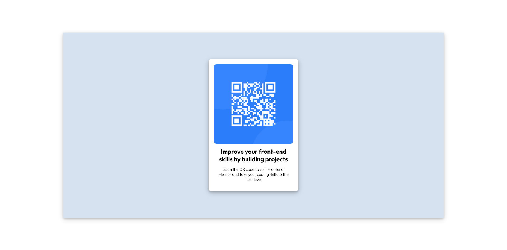

# Frontend Mentor - QR code component solution

This is a solution to the [QR code component challenge on Frontend Mentor](https://www.frontendmentor.io/challenges/qr-code-component-iux_sIO_H). Frontend Mentor challenges help you improve your coding skills by building realistic projects. 


## Overview

### Screenshot




### Links

- Solution URL: [https://spectrunmag.github.io/reto1/]
- Live Site URL: [https://spectrunmag.github.io/reto1/]

## My process

### Built with

- Semantic HTML5 markup
- CSS custom properties
- Flexbox
- CSS Grid
- Mobile-first workflow


### What I learned

Aprendi a utilizar css para dar estilo a la tarjeta. utilizar flexbox para alinear los items dentro de la pagina. utilizar google fonts y boxshadow.


```css
.proud-of-this-css {
  display:flex;
  justify-content :center;
  align-content:center;
  box-shadow: 0 4px 8px 0 rgba(0, 0, 0, 0.2), 0 6px 20px 0 rgba(0, 0, 0, 0.19);
}
```
